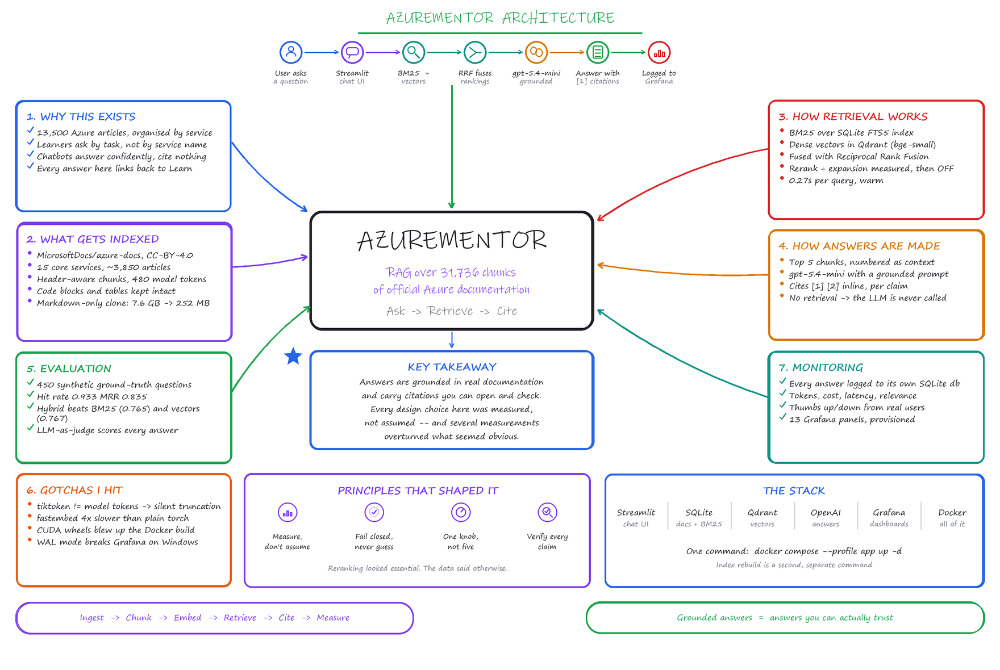
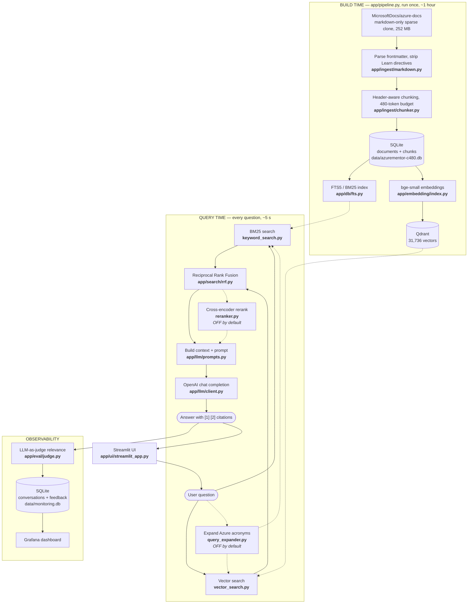
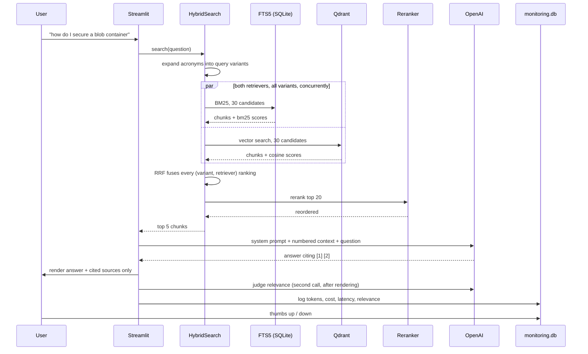

# How AzureMentor works, and where to change it

This is the working reference: what each part does, what happens when, and which
file to open when you want to change something. The [README](README.md) covers
what the project is and how to run it.

---

## The system in one picture



Regenerate with `uv run python assets/make_architecture.py` after editing
`assets/make_architecture.py`.

The same structure, as an editable diagram:



Two things to notice.

**Build time and query time are completely separate.** The pipeline writes SQLite
and Qdrant; the app only reads them. Nothing at query time touches the Azure docs
repository. That is why you can rebuild the index while the app keeps serving the
old one, and why changing a retrieval setting costs nothing but changing a
chunking setting costs an hour.

**Monitoring is a third store.** `data/monitoring.db` is deliberately not the
index — the index gets dropped and recreated by `--fresh`, and conversation
history has to survive that.

---

## What happens when you ask a question



The ordering matters in two places. The judge runs **after** the answer is on
screen, so the user never waits on a call made for our benefit. And if retrieval
returns nothing, the LLM is **never called** — answering with no context is
exactly the confident, uncited guess this project exists to avoid.

---

## Where to change what

The single most useful distinction: **anything that changes the stored data needs
a rebuild (~1 hour); anything that changes retrieval or generation is instant.**

### Instant — no rebuild

| I want to… | Open | Notes |
|---|---|---|
| Return more or fewer chunks to the LLM | `app/search/search_config.py` → `final_limit` | Also `LLM_CONTEXT_CHUNKS` |
| Turn reranking **on** (5.7× slower) | `search_config.py` → `enable_reranking` | Off by default; see [EVALUATION.md](EVALUATION.md) |
| Turn query expansion **on** | `search_config.py` → `enable_query_expansion` | Off by default, measured slightly negative |
| Retrieve more candidates before fusion | `search_config.py` → `keyword_limit`, `vector_limit` | Higher recall, slower rerank |
| Change how BM25 and vectors are blended | `app/search/rrf.py` → `rrf_k` | Lower k = more weight on top ranks |
| Weight header matches vs body in BM25 | `app/db/fts.py` → `BM25_EXPRESSION` | Currently `1.0, 2.0` |
| Add Azure acronyms | `app/search/query_expander.py` → `SYNONYMS` | |
| Change the answer's tone or rules | `app/llm/prompts.py` → add a `PromptTemplate` | Then `--prompt yourname` |
| Switch OpenAI model | `.env` → `LLM_MODEL` | |
| Make answers more/less deterministic | `.env` → `LLM_TEMPERATURE` | |
| Stop judging live answers (halves API calls) | `.env` → `JUDGE_LIVE_ANSWERS=false` | |
| Change what monitoring records | `app/monitoring/schema.py` + `store.py` | New columns need the table dropped |

### Needs a rebuild — `uv run python -m app.pipeline --fresh`

| I want to… | Open | Cost |
|---|---|---|
| Index different Azure services | `app/config.py` → `INGEST_CATEGORIES` | ~1 h for 15 services |
| Index everything (145 services) | `.env` → `INGEST_ALL_CATEGORIES=true` | several hours |
| Add another docs repo (VMs, AKS, Key Vault) | `app/config.py` → `SOURCE_REPOS` | depends on size |
| Change chunk size | `--chunk-size 256` | builds a *separate* index |
| Change chunk overlap | `.env` → `CHUNK_OVERLAP_TOKENS` | defaults to 1/8 of chunk size |
| Strip more Learn markup | `app/ingest/markdown.py` | |
| Change how text is split | `app/ingest/chunker.py` | |
| Switch embedding model | `.env` → `EMBEDDING_MODEL` | re-embeds automatically |
| Skip shorter/longer stub pages | `.env` → `MIN_DOC_TOKENS` | |

Chunk size is special: it is the one knob designed to be swept. `--chunk-size N`
derives the overlap, the minimum chunk size, the database filename **and** the
Qdrant collection name from it, so two chunk sizes build separate indexes and
never overwrite each other. Build both, then switch instantly:

```bash
uv run python -m app.llm.main --chunk-size 256 "what are blob access tiers"
```

---

## Module by module

### `app/config.py` — every setting

One file, all defaults, every value overridable by environment variable. Values
are read **once at import**, which is why the CLI entry points defer their
`app.*` imports until after `--chunk-size` has been turned into an environment
variable. If you add a setting, follow the `_env_int` / `_env_str` / `_env_bool`
pattern so it stays overridable.

Guard rails live here too: a chunk size above the embedding model's 512-token
limit raises at startup rather than silently truncating every chunk.

### `app/ingest/` — turning markdown into chunks

| File | Job |
|---|---|
| `ingest.py` | Clones/refreshes the repo, walks files, orchestrates, writes SQLite |
| `markdown.py` | Frontmatter parsing, strips `[!INCLUDE]`, `:::image`, zone pivots, unwraps links |
| `chunker.py` | Header-aware splitting with a hard token budget |
| `tokenizer.py` | Counts tokens with the **embedding model's** tokenizer, not tiktoken |

The chunker is the subtlest part. It splits on markdown headers, packs whole
blocks up to the budget, never breaks a fenced code block or table unless it
alone exceeds the budget, and prepends the header breadcrumb to every chunk.
Packing runs *across* sections rather than restarting at each header — per
section it produced ~14 chunks per document averaging a third of the budget.

Why the tokenizer matters: `bge-small-en-v1.5` truncates at 512 tokens, and its
WordPiece tokenizer emits ~1.27× more tokens than `cl100k_base` on Azure docs. So
"512 tiktoken tokens" is really ~650 model tokens and the encoder silently drops
the tail of every chunk. There is no error. A final pass in `_enforce_limit`
guarantees nothing ships over budget.

### `app/db/` — SQLite and BM25

`schema.py` has two tables. `documents` is one row per article; `chunks` is the
retrievable unit. `chunks.embedding_model` doubles as the resume marker: it
stores `backend:model`, written only after Qdrant confirms the upsert. Change the
model or backend and every row becomes stale, so re-embedding happens
automatically rather than leaving a half-migrated index.

`fts.py` builds an FTS5 external-content table over `chunks` — it stores only the
inverted index and reads text from `chunks` by rowid, which keeps it small.
`build_match_query` is not optional politeness: raw user text in a `MATCH` clause
is a syntax error the moment someone types a quote or a hyphen.

### `app/embedding/` — vectors

`embedder.py` has two backends behind one interface. **torch is the default and
is ~4× faster than fastembed here** (8.3 vs 2.2 chunks/s measured), because
fastembed ships the int8-quantized ONNX build and quantization only pays off on
CPUs with the right kernels. The two do not share a vector space — switching
re-embeds, enforced by the signature marker.

`index.py` is resumable and tunes Qdrant for bulk loading: HNSW index building is
suspended during upload and restored afterwards, which is Qdrant's documented
recipe and much faster than building the graph incrementally.

### `app/search/` — retrieval

`hybrid_search.py` orchestrates. Each `(query variant, retriever)` pair is fused
as its **own ranking** — concatenating them into two big lists first destroys the
rank positions RRF depends on.

RRF is used rather than score blending because BM25 scores and cosine similarity
are not on comparable scales, and RRF needs only the ordering.

### `app/llm/` — answers

`client.py` records tokens, cost and latency on every call. Note it uses
`max_completion_tokens`, not `max_tokens` — gpt-5.x rejects the latter with a 400.

`prompts.py` holds three named templates so the evaluation has variants to
compare. Adding a fourth is one dict entry.

`rag.py` builds numbered context so citations map to real URLs, and
`cited_sources()` returns only the sources the answer actually references.

### `app/eval/` — measurement

| File | Job |
|---|---|
| `ground_truth.py` | LLM reads a document, writes questions it answers |
| `retrieval.py` | Hit rate, MRR, hit@1, hit@3 across retrieval configs. **Free** |
| `judge.py` | Relevance verdict. Used offline *and* live, so numbers are comparable |
| `answers.py` | Answers ground truth with each prompt, scores with the judge |

`answers.py` reports a **grounding rate** next to relevance: how often the
expected document was actually retrieved. High grounding with low relevance means
the prompt is at fault; low grounding means retrieval is, and no prompt fixes it.

### `app/monitoring/` and `app/ui/`

`store.py` writes one row per answered question. Failures are logged and
swallowed — monitoring must never take down the thing it monitors.

`streamlit_app.py` keeps chat history in session state only. `@st.cache_resource`
on the pipeline is load-bearing: Streamlit re-runs the whole script on every
interaction, and without it the models would reload constantly.

---

## Things that will bite you

**Do not set `DATABASE_PATH` or `QDRANT_COLLECTION` in `.env`.** They derive from
the chunk size. Pinning either sends every chunk size to the same store, silently
turning a comparison between two sizes into a comparison of one against itself.
The pipeline warns if you have.

**A chunk over the model's token limit is truncated with no error.** This is the
easiest way to quietly ruin retrieval. `CHUNK_MAX_TOKENS` is validated at startup
and `_enforce_limit` is a second guarantee.

**Synthetic ground truth flatters keyword search.** Questions generated from a
document reuse its vocabulary. Treat absolute numbers as soft and comparisons
between configurations as sound.

**The corpus has real gaps.** Microsoft split `azure-docs`: virtual machines,
AKS, Key Vault, Cosmos DB, Monitor and Entra ID are in separate repositories and
are **not** indexed. Add them via `SOURCE_REPOS`.

**Cost scales with two switches.** `JUDGE_LIVE_ANSWERS=true` doubles API calls
per question, and `LLM_CONTEXT_CHUNKS` sets how many chunks ride along in every
prompt — the dominant input-token cost.

---

## Adding a pipeline stage

`app/pipeline.py` holds `STAGE_ORDER` and a `STAGES` dict mapping names to
functions. A stage takes `PipelineOptions` and returns a dict of details that
lands in the run summary. Import `app.*` **inside** the function, not at module
level, or `--chunk-size` stops working.

```python
def stage_myThing(options: PipelineOptions) -> dict:
    from app.something import work
    return {"rows": work()}

STAGE_ORDER = ["database", "ingest", "fts", "embed", "myThing", "verify"]
STAGES["myThing"] = stage_myThing
```
