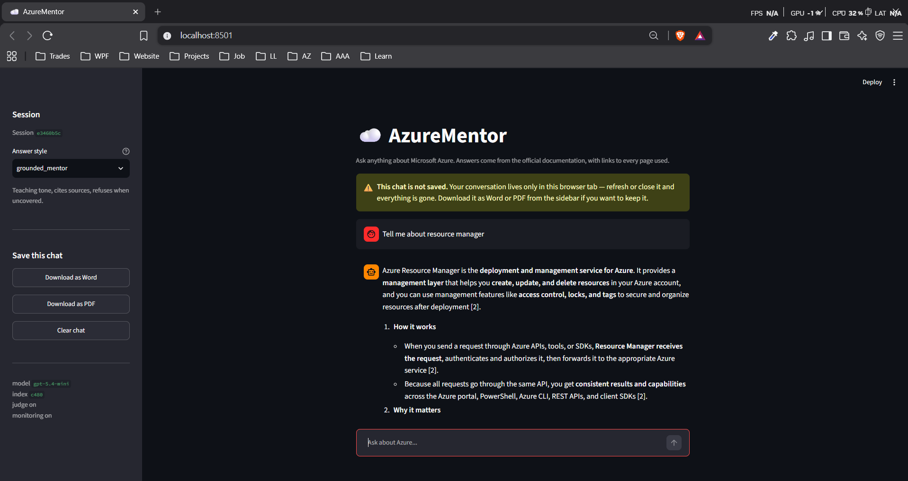
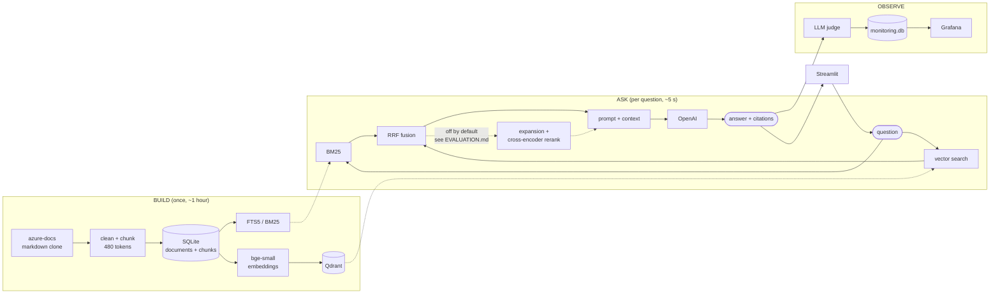
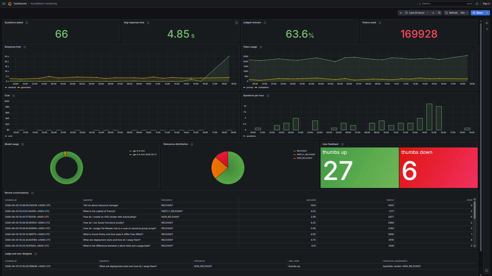

# AzureMentor

**A retrieval-augmented mentor that teaches Microsoft Azure from the official
documentation, and cites every page it used.**

Ask a question in plain English. AzureMentor searches ~32,000 chunks of Microsoft
Learn documentation, feeds the best matches to an LLM, and returns an answer with
inline citations back to the exact pages. If the documentation does not cover
your question, it says so instead of guessing.

Built as the capstone for the [DataTalks.Club LLM Zoomcamp](https://github.com/DataTalksClub/llm-zoomcamp).

> **Deep dive:** [ARCHITECTURE.md](ARCHITECTURE.md) explains how every part works
> and exactly which file to open to change each behaviour.

---

## The problem

Azure's documentation is enormous — roughly 13,500 articles across 145 service
areas — and it is organised **by service**, not by question.

Someone learning Azure has the opposite problem. They know what they want to
accomplish ("how do I stop this storage container being publicly readable?") but
not which service area holds the answer, nor the product vocabulary needed to
search for it. They type `vm` and the docs say "virtual machine". They type
`rbac` and the docs say "role-based access control". Search returns nothing
useful, so they end up on a general-purpose chatbot, which answers confidently,
cites nothing, mixes up Azure with AWS, and describes portal screens that were
redesigned two years ago.

For anyone learning a cloud platform, an answer you cannot verify is worse than
no answer — you will build on it.

**AzureMentor indexes the real documentation and answers only from it.** Every
claim carries a citation to a Microsoft Learn URL you can open. When retrieval
comes back empty, the LLM is never called at all, because an ungrounded answer is
exactly the failure this project exists to prevent.

---

## What it looks like



The sidebar carries the answer-style selector (the prompt templates the
evaluation compares), Word and PDF export, and a live readout of which model and
index are serving you. The banner states plainly that the conversation is not
saved — a promise the app keeps, since history lives only in session state.

Answers cite their sources inline as `[1]`, `[2]`, and only the sources actually
cited are listed underneath.

<details>
<summary>The same thing from the command line</summary>

```
You > How do I stop a blob container from being publicly readable?

To stop a blob container from being publicly readable, set the storage account's
AllowBlobPublicAccess property to false, and set the container's anonymous access
level to Private [1].

  az storage account update --name <account> --resource-group <rg> \
      --allow-blob-public-access false

Why this works: disallowing anonymous access at the account level prevents any
container in that account from being read without authorization, regardless of
the container's own setting [4].

--------------------------------------------------------------------------------
Sources cited (2 of 5 retrieved)
--------------------------------------------------------------------------------
[1] Configure anonymous read access for containers and blobs - Azure Storage
    https://learn.microsoft.com/azure/storage/blobs/anonymous-read-access-configure
[4] Overview of remediating anonymous read access for blob data - Azure Storage
    https://learn.microsoft.com/azure/storage/blobs/anonymous-read-access-overview

retrieval 1.7s  generation 4.3s  |  2282 in + 324 out tokens
```

</details>

---

## Architecture


<details>
<summary>Same thing as a diagram (Mermaid)</summary>



</details>

Full diagrams, including the per-request sequence, are in
[ARCHITECTURE.md](ARCHITECTURE.md). The poster is generated by
`assets/make_architecture.py` — edit that and re-run it to change the image.

---

## Dataset

| | |
|---|---|
| **Source** | [MicrosoftDocs/azure-docs](https://github.com/MicrosoftDocs/azure-docs) — the official Azure documentation, CC-BY-4.0 |
| **How it is obtained** | Cloned automatically by the ingestion pipeline. Nothing to download by hand. |
| **Scope indexed** | 15 core services (app-service, azure-functions, storage, virtual-network, api-management, logic-apps, event-grid, RBAC, ARM, cost-management, governance, security, container-apps, service-bus, static-web-apps) |
| **Volume** | ~3,850 articles → **31,736 chunks** |
| **Ground truth** | `data/ground_truth.csv` — 450 LLM-generated questions, committed so evaluation is reproducible |

The clone is markdown-only: a plain shallow clone costs 7.6 GB because
`articles/` is mostly screenshots. A non-cone sparse checkout with
`--filter=blob:none` fetches **252 MB** — all 15,024 markdown files, zero images.

Widen or narrow the scope with `INGEST_CATEGORIES`, or set
`INGEST_ALL_CATEGORIES=true` for all 145 services.

---

## Running it

### Prerequisites

- **Docker Desktop** (or Docker Engine + Compose)
- **An OpenAI API key** — you supply your own; see [Cost](#cost) below
- For the local (non-Docker) path: **Python 3.13+** and [uv](https://docs.astral.sh/uv/)

### 1. Clone and configure

```bash
git clone <this-repo> && cd azure_qna
```

```bash
cp .env.example .env
```

Open `.env` and set `OPENAI_API_KEY`. Everything else has a working default.

### 2. Start the infrastructure

```bash
docker compose up -d
```

Brings up Qdrant (`:6333`) and Grafana (`:3000`).

### 3. Build the index

This clones the docs, chunks them, builds the BM25 index and embeds everything.

```bash
uv sync
```

```bash
uv run python -m app.pipeline --fresh
```

**Takes about an hour** on an 8-core CPU. It is resumable — if it stops, run the
same command *without* `--fresh` and it continues from where it left off.

> **Reviewing this project and don't want to wait an hour?** Build a small slice
> instead. Roughly three minutes, and everything works — just with less coverage:
>
> ```bash
> INGEST_CATEGORIES=storage uv run python -m app.pipeline --fresh --limit 100
> ```
>
> On Windows PowerShell: `$env:INGEST_CATEGORIES="storage"` first, then run the
> command without the prefix.

### 4. Run the app

```bash
docker compose --profile app up -d --build
```

Open **<http://localhost:8501>**.

Or run it against your local Python instead of in a container:

```bash
uv run streamlit run app/ui/streamlit_app.py
```

### Command-line alternatives

```bash
uv run python -m app.llm.main "how do I restrict blob access to a vnet"
```

```bash
uv run python -m app.search.main "blob access tiers"
```

The second returns raw retrieved chunks with scores — useful for judging
retrieval quality without spending tokens.

### Verify it works

```bash
uv run pytest
```

76 tests, no API calls, no network.

---

## Cost

You run this with your own OpenAI key. There is no hosted instance, deliberately.

Per question, measured:

| | Tokens |
|---|---|
| Prompt (5 chunks of context + question) | ~2,300 |
| Answer | ~300 |
| Relevance judge (optional second call) | ~700 |

The dominant cost is context. Two switches control it:

```bash
LLM_CONTEXT_CHUNKS=3        # fewer chunks per prompt
JUDGE_LIVE_ANSWERS=false    # skip the judge, halves calls per question
```

`LLM_PRICING` in `app/config.py` is a hard-coded table, because prices are not
readable from the API. A model that is not listed reports its token counts
normally but leaves cost as **unknown** rather than inventing a number. To enable
cost tracking for your model, look up its rate and set:

```bash
LLM_PRICE_INPUT_PER_1M=...
LLM_PRICE_OUTPUT_PER_1M=...
```

**Set a spend limit on your API key before you start experimenting.** A full
prompt-evaluation sweep is `prompts × questions × 2` API calls.

---

## Evaluation

Ground truth is synthetic: the LLM reads an indexed document and writes questions
that document answers, so the source document is the correct answer by
construction. 450 questions are committed in `data/ground_truth.csv`.

```bash
uv run python -m app.eval.main generate --sample 150   # regenerate (uses API)
uv run python -m app.eval.main retrieval               # free, no API calls
uv run python -m app.eval.main answers --sample 30     # uses API
uv run python -m app.eval.main live                    # summarise real traffic
```

Results are written to `eval_results/` as timestamped CSVs.

### Retrieval evaluation

Six configurations over the same 450 questions, top-5, scored on hit rate and MRR:

| Configuration | Hit rate | MRR | Hit@1 | s/query |
|---|---|---|---|---|
| keyword only (BM25) | 0.900 | 0.765 | 0.673 | 0.25 |
| vector only | 0.876 | 0.767 | 0.696 | **0.07** |
| **hybrid (RRF)** ← used | 0.933 | **0.835** | **0.771** | 0.33 |
| hybrid + expansion | 0.927 | 0.828 | 0.764 | 0.37 |
| hybrid + rerank | 0.940 | 0.825 | 0.749 | 1.91 |
| hybrid + expansion + rerank | **0.942** | 0.825 | 0.749 | 1.95 |

**Hybrid search is a clear win**: fusing BM25 with vectors lifts MRR from
0.765/0.767 to 0.835, about six times the standard error at n=450.

**Reranking and query expansion were measured and turned off.** The cross-encoder
bought +0.7pp hit rate — inside the ~1.2pp standard error, so not a real
difference — while lowering MRR by 1.0pp and hit@1 by 2.2pp at **5.7× the
latency**. Expansion was slightly negative on every metric. Both remain
implemented, tested and switchable; they are off because the measurement said so.

Full analysis and caveats in **[EVALUATION.md](EVALUATION.md)**.

### LLM evaluation

Three prompt templates — `grounded_mentor`, `concise`, `strict_extractive` —
answer the same questions and are scored by an LLM-as-judge into
`RELEVANT` / `PARTLY_RELEVANT` / `NON_RELEVANT`.

Alongside relevance, the report includes a **grounding rate**: how often the
expected document was actually retrieved. That separates the two failure modes —
high grounding with low relevance is a prompt problem; low grounding is a
retrieval problem no prompt can fix.

The **same judge** scores live traffic in the app, so offline and production
numbers are directly comparable.

> **A caveat, stated honestly:** questions generated from a document tend to
> reuse its vocabulary, which flatters keyword search. Treat absolute numbers as
> soft and the comparisons between configurations as sound.

---

## Monitoring

Every answered question is logged to `data/monitoring.db` — a **separate**
database from the index, because `--fresh` drops the index and conversation
history has to survive that.

Recorded per answer: question, answer, model, prompt template, chunk profile,
retrieval/generation/total latency, prompt/completion/reasoning tokens, cost,
sources retrieved vs cited, the judge's relevance verdict, and any thumbs
up/down from the user.

Grafana reads it directly through the SQLite datasource plugin, provisioned
automatically:

```bash
docker compose up -d grafana
```

<http://localhost:3000> — anonymous read-only, `admin`/`admin` to edit.

A dashboard with **13 panels** is provisioned automatically. Open
<http://localhost:3000/d/azurementor-monitoring>.



Response time split by stage, token usage, cost, questions per hour, model usage,
the judge's relevance breakdown, user thumbs, and a recent-conversations table.
The screenshot is real traffic: note the judge marking *"How do I create an AKS
cluster with autoscaling?"* as `NON_RELEVANT` with **0** sources cited — AKS is
one of the services Microsoft moved out of this repository, so the system
correctly declines rather than inventing an answer.

**[grafana/DASHBOARD.md](grafana/DASHBOARD.md)** explains every panel and how the
course lesson's PostgreSQL translates to SQLite.
**[grafana/README.md](grafana/README.md)** has the datasource wiring, the full
schema, and a wider query cookbook. Every SQL block in both has been executed
against the live datasource.

---

## Configuration

Every setting lives in `app/config.py` and is overridable by environment
variable. See [.env.example](.env.example) for the full annotated list.

| Variable | Default | What it does |
|---|---|---|
| `OPENAI_API_KEY` | — | **Required** |
| `LLM_MODEL` | `gpt-5.4-mini` | Answering model |
| `LLM_PROMPT` | `grounded_mentor` | Prompt template |
| `LLM_CONTEXT_CHUNKS` | `5` | Chunks per prompt — the main cost lever |
| `JUDGE_LIVE_ANSWERS` | `true` | Judge live answers (doubles API calls) |
| `INGEST_CATEGORIES` | 15 services | Which Azure services to index |
| `CHUNK_MAX_TOKENS` | `480` | Chunk size; derives overlap, DB name, collection |
| `EMBEDDING_MODEL` | `BAAI/bge-small-en-v1.5` | |
| `EMBEDDING_BACKEND` | `torch` | or `fastembed` |

**Do not set `DATABASE_PATH` or `QDRANT_COLLECTION`.** They derive from the chunk
size so different chunk experiments cannot overwrite each other. Pinning them
silently turns a comparison between two chunk sizes into a comparison of one
against itself. The pipeline warns if you have.

---

## Ingestion pipeline

One entry point runs every stage in dependency order, logging timing and row
counts to both the console and a timestamped file in `logs/`.

| Stage | Does |
|---|---|
| `database` | Creates the schema and the FTS5 virtual table |
| `ingest` | Syncs the docs repo, cleans, chunks, loads SQLite |
| `fts` | Rebuilds the BM25 index |
| `embed` | Embeds chunks and upserts into Qdrant |
| `verify` | Cross-checks counts and runs a live probe query |

```bash
uv run python -m app.pipeline --fresh          # full rebuild
uv run python -m app.pipeline --from embed     # resume from a stage
uv run python -m app.pipeline --stages fts     # one stage only
uv run python -m app.pipeline --limit 40       # smoke test, ~80 seconds
```

Exit codes: `0` success, `1` a stage raised, `2` ran but `verify` found an
inconsistency.

---

## Project structure

```
app/
  config.py            all settings, environment-overridable
  pipeline.py          the single ingestion entry point
  db/                  SQLite schema, connection, FTS5 index
  ingest/              repo sync, markdown cleaning, chunking, tokenizer
  embedding/           torch + fastembed backends, Qdrant, resumable indexer
  search/              hybrid search, BM25, vectors, RRF, reranker, expansion
  llm/                 OpenAI client, prompts, RAG orchestration, CLI
  eval/                ground truth, retrieval metrics, judge, answer eval
  monitoring/          conversations + feedback schema and store
  ui/                  Streamlit app, docx/pdf export
tests/                 76 tests, no network
grafana/               datasource provisioning + query cookbook
```

---

## How this maps to the evaluation criteria

| Criterion | Max | Self-assessment |
|---|---|---|
| Problem description | 2 | Described above with the specific failure it addresses |
| Retrieval flow | 2 | Knowledge base (Qdrant + FTS5) **and** LLM |
| Retrieval evaluation | 2 | 6 configurations swept; see [EVALUATION.md](EVALUATION.md) |
| LLM evaluation | 2 | 3 prompt templates scored by LLM-as-judge |
| Interface | 2 | Streamlit UI, plus two CLIs |
| Ingestion pipeline | 2 | Automated, staged, resumable — `app/pipeline.py` |
| Monitoring | 2 | Feedback collected + provisioned Grafana dashboard with 13 panels |
| Containerization | 2 | Everything in `docker-compose`, app included |
| Reproducibility | 2 | Data fetched automatically; instructions above |
| Hybrid search | 1 | BM25 + vectors fused with RRF; measured **+7pp MRR** over either alone |
| Document re-ranking | 1 | Cross-encoder implemented and evaluated; off by default because it did not help |
| Query rewriting | 1 | Acronym expansion implemented and evaluated; off by default, same reason |
| Cloud deployment | +2 | **Not done** — deliberate, see below |

### One deliberate gap

**No cloud deployment.** This runs on the operator's own OpenAI key, and a
publicly reachable URL means paying for every stranger's questions. The
containerization works and the deployment path is documented in
[ARCHITECTURE.md](ARCHITECTURE.md); it is simply not switched on.

---

## Known limitations

**The corpus has gaps.** Microsoft split the `azure-docs` repository — virtual
machines, AKS, Key Vault, Cosmos DB, Monitor and Entra ID now live in separate
repositories and are **not** indexed. `SOURCE_REPOS` in `app/config.py` is a list
so they can be added.

**Ingestion is not incremental.** Re-running it clears and reloads, which
reassigns chunk ids and forces a full re-embed. Content-hash-based upsert would
fix this.

**First question is slow.** ~20 seconds while the embedding and reranking models
load; ~5 seconds after that.

**Answers are only as current as the clone.** Re-run with `--refresh-source` to
pull newer documentation.

---

## Contributing

Fork it, break it, send it back better. Issues and pull requests are both
welcome, and so is a comment telling me a measurement here is wrong.

### Getting set up

```bash
git clone https://github.com/<your-username>/azure_qna.git && cd azure_qna
```

```bash
uv sync && cp .env.example .env
```

Put your own `OPENAI_API_KEY` in `.env`, then start the infrastructure:

```bash
docker compose up -d
```

**Do not build the full index while developing.** An hour is a long feedback
loop. Build a slice instead — about three minutes, and every feature works:

```bash
INGEST_CATEGORIES=storage uv run python -m app.pipeline --fresh --limit 100
```

On Windows PowerShell, set `$env:INGEST_CATEGORIES="storage"` first, then run the
command without the prefix.

Most work needs no API key at all. Retrieval, chunking, the FTS index and the
whole test suite run offline; only answer generation, the judge and ground-truth
generation call OpenAI.

### Before you open a PR

```bash
uv run pytest
```

76 tests, no network calls, a few seconds. They must pass.

If you touched anything under `app/ingest/` or `app/search/`, **re-run the
retrieval evaluation and put the numbers in the PR**:

```bash
uv run python -m app.eval.main retrieval
```

It costs no API calls, and it is the difference between "this feels better" and
"this is better". Several changes in this repo were reverted because the numbers
disagreed with the intuition — that is the norm here, not a failure.

If you changed SQL in `grafana/`, check it actually runs against the datasource
rather than only reading correctly. Untested SQL in those docs has bitten this
project once already.

### Things worth working on

Concrete gaps, roughly easiest first:

- **Fix the acronym false positive.** `asp` matches inside `ASP.NET`, so
  "deploy an ASP.NET Core app" expands to "App Service plan.NET Core". See
  `app/search/query_expander.py`. The list also contains acronyms for services
  that are not in the index.
- **Add the missing documentation repos.** Virtual machines, AKS, Key Vault,
  Cosmos DB, Monitor and Entra ID live in separate repositories now and are not
  indexed. `SOURCE_REPOS` in `app/config.py` is a list for exactly this.
- **A serving-only index.** Most of the 432 MB database is `documents.content`,
  which query time never reads. Stripping it should land near 80 MB and change
  what is deployable.
- **Incremental ingestion.** Re-running clears and reloads, which reassigns chunk
  ids and forces a full re-embed. Content-hash upsert would fix it.
- **Parent-document retrieval.** Embed small chunks for sharp matching, then
  expand each hit to its surrounding section before generation. The schema
  already supports it — `document_id`, `chunk_index` and `header_path` are all
  there.
- **LLM-based query rewriting**, to replace the hand-written acronym dictionary.
  Then A/B all three against each other.
- **Agentic RAG** — let the model decide whether to search again, refine, or
  answer.
- **Cloud deployment**, with a sensible rate limit so a public URL does not
  become someone else's API bill.

### House style

Match what is already there. Two things in particular:

**Comments explain why, not what.** The code says what it does. A comment earns
its place by recording a decision, a measurement, or a trap — why chunking uses
the embedding model's tokenizer, why the monitoring database is not in WAL mode.

**Claims come with evidence.** If you assert something is faster, better or
required, say how you know. A number, a link, or a reproducible command.

### What not to commit

`.gitignore` already covers it, but worth knowing: the index (`data/*.db`),
the Qdrant storage (`qdrant_data/`), the cloned docs (`data/source/`) and logs
never go in. `data/ground_truth.csv` **is** committed on purpose, so evaluation
results stay reproducible.

---

## Acknowledgements

Documentation content from [MicrosoftDocs/azure-docs](https://github.com/MicrosoftDocs/azure-docs), CC-BY-4.0.
Built for the [DataTalks.Club LLM Zoomcamp](https://github.com/DataTalksClub/llm-zoomcamp).
